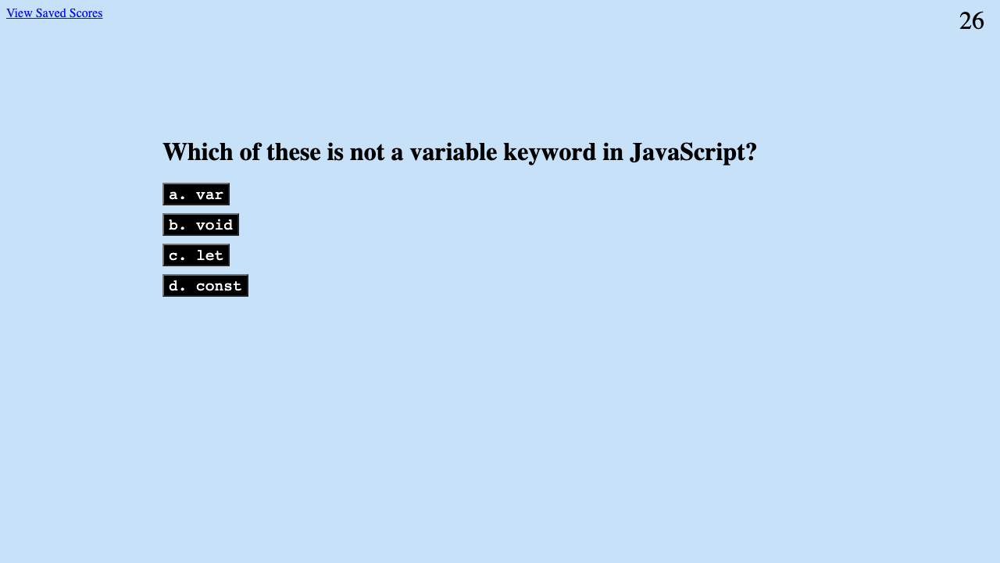

# The JavaScript Quiz

## Just a little test for you.

This is a simple code quiz that showcases a page that dynamically changes using JavaScript as well as saving data into local storage in the form of saved quiz scores organized by submitted initials.

There are five questions that the user has 30 seconds to answer, with five seconds being taken off for every missed answer. The end score is the number of correct answers multiplied by the number of seconds left on the timer. After the quiz is complete, the user has the option to save their score with their initials which is then saved into local storage. The user is then able to view every submitted score on a "saved scores page" that has a table populated from the local storage. This will persist until the cache is cleared.

## Here's what it looks like:

## Live quiz on GitHub:

### [Live Website](https://chrisaeus.github.io/JavaScript-Quiz/)